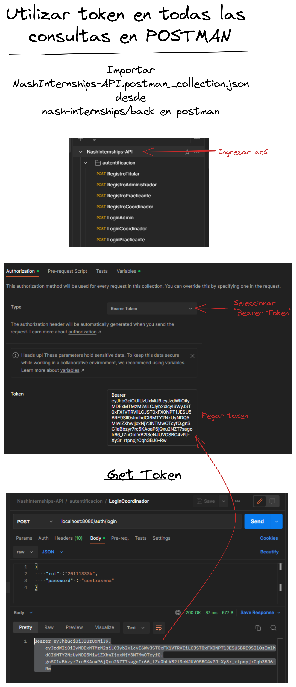

# Nash Internships: API

API REST para el proyecto Nash Internships


## Prerrequisitos

Se debe tener instalado los siguientes elementos

### Windows

- [`Java 11`](https://www.oracle.com/java/technologies/downloads/#java11)

- [`MongoDB`](https://www.mongodb.com/try/download/community)

- [`Git`](https://git-scm.com/)

### Linux Ubuntu

- [`Java 11`](https://www.oracle.com/java/technologies/downloads/#java11)

- [`Git`](https://git-scm.com/)

- [`Docker`](https://www.docker.com/)

- [`Docker-Compose`](https://docs.docker.com/compose/install/)
  
  #### Base de datos
  
  Se instala la base de datos como contendedor de docker:
  
  ```bash
  sudo docker pull mongo
  ```
  
  

## Instrucciones

A continuación se listarán las instrucciones para ejecutar el proyecto

#### 1. Clonar repositorio

```git
git clone https://gitlab.com/proyecto-investigacion-e-innovacion/2s-2022/nash-internships/nash-internships-back.git
```

#### 2. Moverse a carpeta del proyecto

```bash
cd nash-internships-back/
```

#### 3. Inicializar Git Flow

```git
git flow init -d
```

#### 4. Instalar Dependencias

```bash
mvn install
```

#### 5. Ejecutar Proyecto

```bash
mvn spring-boot::run
```



Se debe apuntar el token para realizar consultas, con esto no hay necesidad de explicitar el token por cada consulta

##### 5.1 Linux Ubuntu

En el caso de linux se debe iniciar la base de datos utilizando la imagen de docker previamente instalada:

```bash
sudo docker-compose up
```


